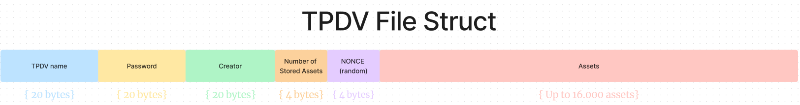
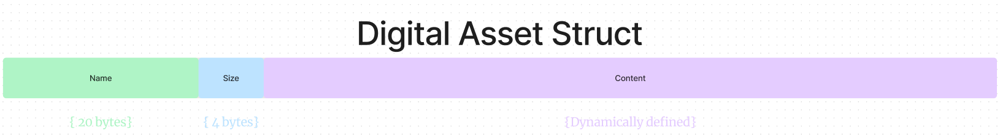

# Trabalho prático 1 de Ambientes de Execução Seguros

## Autores
- João Almeida (118340)
- Simão Andrade (118345)

## Objetivos

Implementar um cofre digital à **prova de adulteração de arquivos** (TPDV), utilizando **Intel SGX enclaves**. O cofre pode ser destruído, mas nunca vai ser possível mudar o conteúdo dos arquivos sem que o cofre perceba. O foco desta implementação é a **integridade** dos arquivos, **não a confidencialidade**.

O programa deve ser capaz de: (Funções de adição têm que ir para o enclave)
- [x] Criar um ficheiro TPDV.
- [x] Adicionar um arquivo ao TPDV.
- [x] Listar os arquivos no TPDV.
- [x] Extrair um arquivo (ou todos) do TPDV.
- [ ] Calcular o hash de um arquivo no TPDV.
- [x] Alterar a password do TPDV.
- [ ] Clonar o TPDV para outro SGX enclave.

## Implementação

Os dados do TPDV são selados (*sealed*) e armazenados num ficheiro. Toda a informação é armazenada num `unsigned int array`.

O cabeçalho do ficheiro é composto por:

<p align="center">
  
</p>
<p align="center">
  <i>Fig. 1 - Header do TPDV</i>
</p>

> **Nota:** O campo `NONCE` representa os últimos 4 bytes do hash de todos os assets

Cada ficheiro adicionado ao TPDV é composto por:

<p align="center">
  
</p>

<p align="center">
  <i>Fig. 2 - Estrutura de um arquivo no TPDV</i>
</p>

> **Nota:** O tamanho do conteúdo do ficheiro não é estático.

### Funções

O programa é dividido em **dois tipos** de funções:
- Funções "seguras": são executadas dentro do enclave e têm acesso a memória selada.
  - `unsealed`
  - `sealed`
  - `get_sealed_size`
- Funções "não seguras": são executadas fora do enclave e têm acesso a memória não selada. 
  - `create_tpdv`
  - `add_asset`
  - `list_assets`
  - `change_password`
  - `check_asset_integrity`

#### `create_tpdv`

Esta função é responsável por criar um ficheiro TPDV. O ficheiro é criado com o cabeçalho e o array de ficheiros vazio.

A função tem o seguinte header:
```c
int create_tpdv(const uint8_t *filename,const uint32_t filename_size,const uint8_t *password,const uint32_t password_size,const uint8_t *creator,const uint32_t creator_size);
```

E devolve `0` em caso de sucesso e `1` em caso de erro.

#### `add_asset`

Esta função é responsável por adicionar um ficheiro ao TPDV. O ficheiro é adicionado ao array de ficheiros e o array é selado.

A função tem o seguinte header:
```c
int add_asset(const uint8_t *filename,const uint32_t filename_size,const uint8_t *password,const uint32_t password_size,const uint8_t *asset,const uint32_t asset_size);
```

E devolve `0` em caso de sucesso e `1` em caso de erro.

#### `list_assets`

Esta função é responsável por listar os ficheiros no TPDV. A função desencripta o array de ficheiros e imprime o nome de cada ficheiro.

A função tem o seguinte header:
```c
int list_assets(const uint8_t *filename, const uint8_t *password);
```

E devolve `0` em caso de sucesso e `1` em caso de erro.

#### `change_password`

Esta função é responsável por alterar a password do TPDV. A função dá *unseal* o array de ficheiros, altera a password e *seal* o array.

A função tem o seguinte header:
```c
int change_password(const uint8_t *filename, const uint8_t *old_password, const uint8_t *new_password);
```

E devolve `0` em caso de sucesso e `1` em caso de erro.

#### `check_asset_integrity`

Esta função é responsável por verificar a integridade de um ficheiro no TPDV. A função dá lê o conteúdo do ficheiro, dá *unseal* ao TPDV e verifica se o hash do ficheiro corresponde ao hash do conteúdo guardado no TPDV.

A função tem o seguinte header:
```c
int check_asset_integrity(const uint8_t *filename, const uint8_t *password, const uint8_t *asset_filename)
```

E devolve `0` em caso de sucesso e `1` em caso de erro.

### Fluxo de execução da aplicação

## Compilação

Para compilar o programa, basta executar os seguintes comandos:

```bash
$ make
$ ./app
```

## Conclusão

