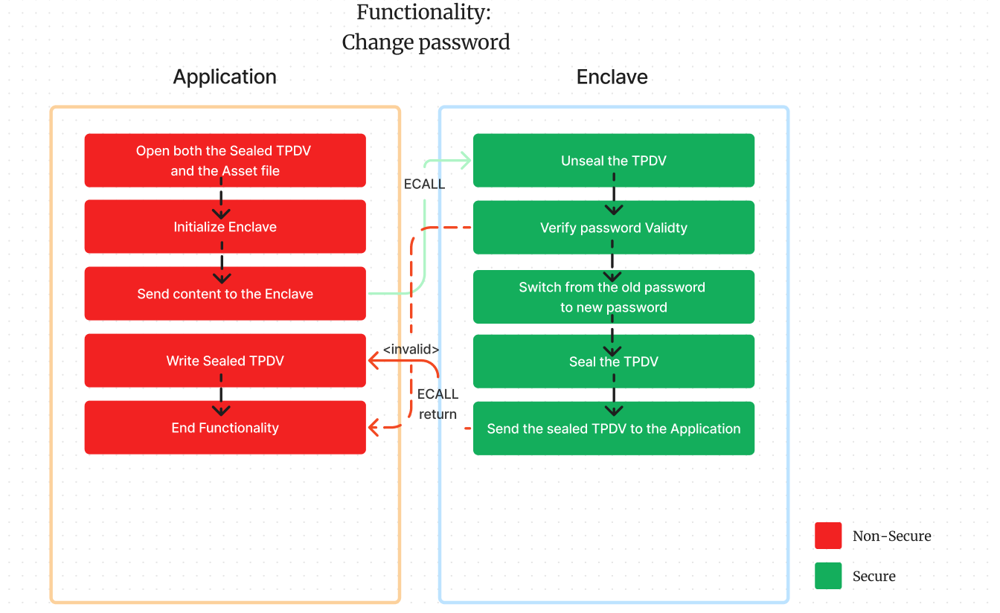

# *Tamper Proof Data Vault* (TPDV)

## Autores
- João Almeida (118340)
- Simão Andrade (118345)

## Objetivos

Implementar um cofre digital, utilizando **Intel SGX enclaves**. O cofre pode ser destruído, mas nunca vai ser possível mudar o conteúdo dos arquivos sem que o cofre perceba. O foco desta implementação é a **integridade** dos arquivos, **não a confidencialidade**.

O programa deve ser capaz de:
- [x] Criar um ficheiro TPDV.
- [x] Adicionar um arquivo ao TPDV.
- [x] Listar os arquivos no TPDV.
- [x] Extrair um arquivo (ou todos) do TPDV.
- [x] Calcular o hash de um arquivo no TPDV.
- [x] Alterar a password do TPDV.
- [x] Clonar o TPDV para outro SGX enclave.

## Implementação

Os dados do TPDV são selados (*sealed*) e armazenados num ficheiro. Toda a informação é armazenada num `unsigned int array`.

O cabeçalho do ficheiro é composto por:

<p align="center">
  
</p>
<p align="center">
  <i>Fig. 1 - Header do TPDV</i>
</p>

> **Nota:** O campo `NONCE` representa os últimos 4 bytes do hash de todos os assets. Este é usado para verificar a integridade do TPDV, adicionando uma nova camada de segurança.

Cada ficheiro adicionado ao TPDV é composto por:

<p align="center">
  
</p>

<p align="center">
  <i>Fig. 2 - Estrutura de um arquivo no TPDV</i>
</p>

### Arquitetura do Programa

O programa é dividido em **dois tipos** de funções:
- **Seguras**: são executadas dentro do enclave e têm acesso a memória selada.
- **Não seguras**: são executadas fora do enclave e têm acesso a memória não selada. 

| Funções seguras                | Funções não seguras     |
| ------------------------------ | ----------------------- |
| `unsealed`                     | `create_tpdv`           |
| `sealed`                       | `add_asset`             |
| `get_sealed_size`              | `list_assets`           |
| `e1_check_password`            | `change_password`       |
| `e1_add_asset`                 | `retrieve_asset`        |
| `e1_list_all_assets`           | `check_asset_integrity` |
| `e1_get_asset_size`            | `clone_tpdv`            |
| `e1_retrieve_asset`            |                         |
| `e1_change_password`           |                         |
| `e1_get_asset_hash_from_vault` |                         |
| `e1_unseal_and_cipher`         |                         |
| `e1_decipher_and_seal`         |                         |

### Funcionalidades

#### Criação do TPDV

Esta funcionalidade é responsável por criar um ficheiro TPDV. O ficheiro é criado com o cabeçalho do TPDV conforme o descrito anteriormente e sem arquivos.

A função no `App.cpp` tem o seguinte cabeçalho:
```c
int create_tpdv(const uint8_t *filename,const uint32_t filename_size,const uint8_t *password,const uint32_t password_size,const uint8_t *creator,const uint32_t creator_size);
```

E devolve `0` em caso de sucesso e `1` em caso de erro.

> Nesta implementação, a criação do TPDV é toda feita fora do enclave.

#### Adicionar um arquivo ao TPDV

Esta funcionalidade é responsável por adicionar um ficheiro ao TPDV. O ficheiro é adicionado ao array TDPV, sendo novamente selado e guardado no ficheiro.

A função no `App.cpp` tem o seguinte cabeçalho:
```c
int add_asset(const uint8_t *filename,const uint32_t filename_size,const uint8_t *password,const uint32_t password_size,const uint8_t *asset,const uint32_t asset_size);
```

E devolve `0` em caso de sucesso e `1` em caso de erro.

Para manipular o ficheiro TPDV é feita uma ECALL (chamada para dentro do enclave) com a função `e1_add_asset`. Esta função é responsável por adicionar o arquivo ao TDPV dando *unseal* ao conteúdo do TPDV, adicionando o ficheiro e *seal* o conteúdo do TPDV.

Este fluxo é ilustrado usando a seguinte figura:

<p align="center">
  
</p>
<p align="center">
  <i>Fig. 3 - Adicionar um ficheiro ao TPDV</i>
</p>

> O processo de manipulação do ficheiro TPDV é feito **dentro do enclave** de modo a garantir que a informação é manipulada apenas pela informação fornecida pela aplicação cliente. Deste modo a integridade da informação é garantida, uma vez que a informação é selada e não pode ser alterada fora do enclave sem que seja detetado.

#### Listar os arquivos no TPDV

Esta funcionalidade é responsável por enumerar todos os ficheiros no TPDV. A função dá *unseal* ao TPDV e lê o conteúdo do array, enviando o resultado para o `stdout` através de um OCALL para a aplicação cliente.

A função no `App.cpp` tem o seguinte cabeçalho:
```c
int list_assets(const uint8_t *filename, const uint8_t *password);
```

E devolve `0` em caso de sucesso e `1` em caso de erro.

Para dar *unseal* ao TPDV de forma segura, é feita uma ECALL para a função `e1_list_all_assets`. Esta função é responsável por dar *unseal* ao conteúdo do TPDV e devolver o conteúdo.

Este fluxo é ilustrado usando a seguinte figura:

<p align="center">
  
</p>
<p align="center">
  <i>Fig. 4 - Listar os ficheiros no TPDV</i>
</p>

#### Alterar as credênciais do TPDV

Esta funcionalidade é responsável por alterar a password do TPDV. A função dá *unseal* ao TPDV, verifica a password antiga, altera a password, dá *seal* ao TPDV e guarda o conteúdo no ficheiro.

A função no `App.cpp` tem o seguinte cabeçalho:
```c
int change_password(const uint8_t *filename, const uint8_t *old_password, const uint8_t *new_password);
```

E devolve `0` em caso de sucesso e `1` em caso de erro.

Para alterar a password de forma segura, é feita uma ECALL para a função `e1_change_password`. Esta função é responsável por dar *unseal* ao conteúdo do TPDV, verificar a password antiga, alterar a password, *seal* o conteúdo do TPDV e guardar o conteúdo no ficheiro.

Este fluxo é ilustrado usando a seguinte figura:

<p align="center">
  
</p>
<p align="center">
  <i>Fig. 5 - Alterar a password do TPDV</i>
</p>

#### Verificar a integridade de um ficheiro no TPDV

Esta funcionalidade é responsável por verificar a integridade de um ficheiro no TPDV. A função dá lê o conteúdo do ficheiro, dá *unseal* ao TPDV e verifica se o hash do ficheiro corresponde ao hash do conteúdo guardado no TPDV.

A função tem o seguinte cabeçalho:
```c
int check_asset_integrity(const uint8_t *filename, const uint8_t *password, const uint8_t *asset_filename)
```

E devolve `0` em caso de sucesso e `1` em caso de erro.

Para verificar a integridade de um ficheiro de forma segura, é feita uma ECALL para a função `e1_get_asset_hash_from_vault`. Esta função é responsável por dar *unseal* ao conteúdo do TPDV, procurar o ficheiro e devolver o hash do ficheiro.

Este fluxo é ilustrado usando a seguinte figura:

<p align="center">
  
</p>
<p align="center">
  <i>Fig. 5 - Verificar a integridade de um ficheiro no TPDV</i>
</p>

#### Extrair um ficheiro do TPDV

Esta funcionalidade é responsável por extrair um ficheiro do TPDV. A função dá *unseal* ao TPDV, procura o ficheiro e devolve o conteúdo do ficheiro.

A função tem o seguinte cabeçalho:
```c
int retrieve_asset(const uint8_t *filename, const uint8_t *password, const uint8_t *asset_filename)
```

E devolve `0` em caso de sucesso e `1` em caso de erro.

Para extrair um ficheiro de forma segura, é feita uma ECALL para a função `e1_retrieve_asset`. Esta função é responsável por dar *unseal* ao conteúdo do TPDV, procurar o ficheiro e devolver o conteúdo.

Este fluxo é ilustrado usando a seguinte figura:

<p align="center">
  
</p>
<p align="center">
  <i>Fig. 5 - Extrair um ficheiro do TPDV</i>
</p>

#### Copiar o TPDV para outro enclave

Esta funcionalidade é responsável por clonar o TPDV para outro enclave.

A função tem o seguinte cabeçalho:
```c
int clone_tpdv(const uint8_t *original_tpdv, const uint8_t *original_password, const uint8_t *cloned_tpdv, const uint8_t *cloned_password)
```

Para clonar o TPDV de forma segura, foi feita uma troca de mensagens entre os dois enclaves, para estabelecer uma chave secreta partilhada. Para isso, foi utilizada a biblioteca `sgx_dh.h` da Intel SGX, que fornece funções para a troca de chaves Diffie-Hellman.

<p align="center">
  
</p>
<p align="center">
  <i>Fig. 6 - Troca de chaves c/ SGX enclaves</i>
</p>

Na prática:
1. `e1_init_session` (Enclave 1): Enclave 1 começa o processo de troca de chave, inicializando uma sessão Diffie-Hellman.
2. `e2_init_session` (Enclave 2): Enclave 2 também inicia sua sessão Diffie-Hellman.
3. `e2_create_message1` (Enclave 2): Enclave 2 gera a primeira mensagem que contém informações para a troca de chave.
4. Enviar Mensagem 1: Enclave 2 envia esta mensagem para Enclave 1.
5. `e1_process_message1` (Enclave 1): Enclave 1 recebe a mensagem e processa-a para gerar sua própria mensagem baseada nela.
6. Enviar Mensagem 2: Enclave 1 envia sua mensagem gerada para Enclave 2.
7. `e2_process_message2` (Enclave 2): Enclave 2 recebe a mensagem de Enclave 1 e processa-a para completar a troca de chave.
8. Enviar Mensagem 3: Enclave 2 envia sua última mensagem para Enclave 1.
9. `e1_process_message3` (Enclave 1): Enclave 1 recebe a mensagem final e finaliza o processo, concordando com a chave secreta compartilhada.

Esta chave é usada para cifrar o conteúdo do TPDV dentro do enclave de origem e decifrar o conteúdo no enclave de destino, onde de seguida o mesmo irá ser selado usando o segundo enclave e guardado num ficheiro.

Este fluxo é ilustrado usando a seguinte figura:

<p align="center">
  
</p>
<p align="center">
  <i>Fig. 7 - Clonar o TPDV</i>
</p>

## Testes e Resultados

Aqui é apresentadas as verificações que foram feitas ao funcionamento do programa, bem como os resultados obtidos.

<p align="center">
  
</p>
<p align="center">
  <i>Fig. 8 - Menu do programa</i>
</p>

### Resultado da Manipulação do TPDV

Dentro do enclave, o TPDV é manipulado de forma segura, garantindo a integridade dos ficheiros. Caso o TPDV seja manipulado fora do enclave, o programa deteta a adulteração, pois é feita a verificação do hash dos arquivos.

Neste teste foi alterado apenas um byte do ficheiro TPDV.

<p align="center">
  
</p>
<p align="center">
  <i>Fig. 9 - Resultado da manipulação do TPDV usando o VIM</i>
</p>

Devolvendo a seguinte mensagem de erro:

<p align="center">
  
</p>
<p align="center">
  <i>Fig. 10 - Resultado da manipulação do TPDV</i>
</p>

> Esta verificação provém do `check_nonce_integrity`.

### Listagem de ficheiros

Todos os ficheiros presentes no TPDV podem ser listados, referindo o nome e o tamanho dos ficheiros.

Esta funcionalidade requer autenticação, sendo necessário fornecer a credencial do TPDV.

<p align="center">
  
</p>
<p align="center">
  <i>Fig. 11 - Listagem de ficheiros</i>
</p>

Obtendo o seguinte resultado:

<p align="center">
  
</p>
<p align="center">
  <i>Fig. 12 - Listagem de ficheiros</i>
</p>

### Alteração das credênciais do TPDV

As credenciais do TPDV podem ser alteradas, sendo necessário fornecer a credencial atual e a nova credencial.

<p align="center">
  
</p>
<p align="center">
  <i>Fig. 13 - Alteração das credênciais do TPDV</i>
</p>

Dando a seguinte mensagem de sucesso:

<p align="center">
  
</p>
<p align="center">
  <i>Fig. 14 - Mensagem de sucesso na alteração das credênciais do TPDV</i>
</p>

Caso o utilizador insira a credencial antiga, o programa devolve a seguinte mensagem de erro:

<p align="center">
  
</p>
<p align="center">
  <i>Fig. 15 - Mensagem de erro na alteração das credênciais do TPDV</i>
</p>

### Validação da integridade dos ficheiros

Qualquer arquivo presente no TPDV pode ser validado, verificando se o hash do arquivo corresponde ao hash guardado no TPDV.

<p align="center">
  
</p>
<p align="center">
  <i>Fig. 16 - Validação da integridade dos ficheiros</i>
</p>

Caso seja adulterado parte do ficheiro, o programa irá detetar a adulteração.

<p align="center">
  
</p>
<p align="center">
  <i>Fig. 17 - Adulteração de um arquivo no TPDV</i>
</p>

E será devolvida a seguinte mensagem de erro:
<p align="center">
  
</p>
<p align="center">
  <i>Fig. 18 - Mensagem de erro na validação da integridade dos ficheiros</i>
</p>

### Clonagem do TPDV 

Para clonar o TPDV, é necessário fornecer as credenciais do TPDV de origem e de destino.

<p align="center">
  
</p>
<p align="center">
  <i>Fig. 19 - Autenticação do TPDV a Clonar</i>
</p>

<p align="center">
  
</p>
<p align="center">
  <i>Fig. 20 - Clonagem do TPDV</i>
</p>

Dando a seguinte mensagem de sucesso:

<p align="center">
  
</p>
<p align="center">
  <i>Fig. 21 - Mensagem de sucesso na clonagem do TPDV</i>
</p>

Criando um novo ficheiro TPDV com o mesmo conteúdo do ficheiro original. No momento, o utilizador pode apenas listar os ficheiros presentes no TPDV clonado.

<p align="center">
  
</p>
<p align="center">
  <i>Fig. 22 - Autenticação do Clone do TPDV</i>
</p>

<p align="center">
  
</p>
<p align="center">
  <i>Fig. 23 - Listagem de ficheiros do TPDV clonado</i>
</p>

## Documentação

A documentação do código foi feita com o Doxygen. Para gerar a documentação, basta executar o seguinte comando:

```bash
$ doxygen Doxyfile
```

Onde a documentação será gerada na pasta `docs/`.

> [!NOTE]
> Não foi adicionada, pois o Doxygen não se encontra presente na máquina de desenvolvimento.

## Execução

Para compilar o programa, basta executar os seguintes comandos:

```bash
$ make
$ ./app
```

> [!IMPORTANT]
> Deve ser gerado um novo par de chaves RSA para o enclave, para isso basta executar o script `new_private_key.bash`.

## Conclusão

Em conclusão, conseguimos implementar com sucesso o TPDV utilizando Intel SGX enclaves, garantindo assim um ambiente seguro para armazenamento e manipulação de arquivos. Ao longo do desenvolvimento, enfrentamos desafios significativos, especialmente na definição das funcionalidades críticas a serem executadas dentro dos enclaves. No entanto, superamos esses obstáculos e conseguimos finalizar todos os objetivos estabelecidos.

Durante os testes realizados, o TPDV demonstrou a sua eficácia ao detectar falhas de integridade, listar e extrair arquivos, realizar alterações de credenciais e validar a integridade dos arquivos armazenados, tudo sem comprometer a segurança dos dados. Além disso, foram feitos esforços para melhorar o desempenho da aplicação.

Esta experiência foi extremamente enriquecedora, proporcionando conhecimentos valiosos sobre o desenvolvimento de *software* utilizando segurança a nível de *hardware* e sobre o desenvolvimento de aplicações com foco na integridade. 

O êxito na implementação do TPDV não apenas ressalta a importância da integridade dos dados em ambientes digitais, mas também destaca o potencial das tecnologias como Intel SGX enclaves na proteção desses dados.

## Referências

[Overview of Intel SGX Enclave - by Intel](https://www.intel.com/content/dam/develop/external/us/en/documents/overview-of-intel-sgx-enclave-637284.pdf)

[Repositório Github do Intel SGX](https://github.com/intel/linux-sgx)

[Repositório Exemplo: HelloEnclave](https://github.com/digawp/hello-enclave)
