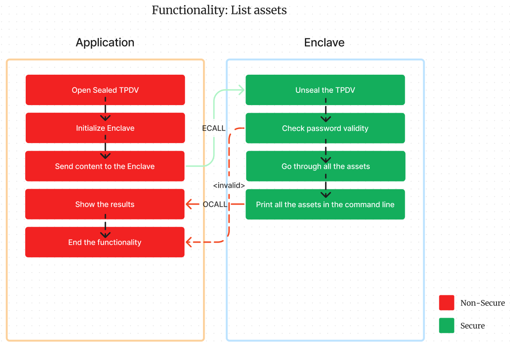

# Trabalho prático 1 de Ambientes de Execução Seguros

## Autores
- João Almeida (118340)
- Simão Andrade (118345)

## Objetivos

Implementar um cofre digital à **prova de adulteração de arquivos** (TPDV), utilizando **Intel SGX enclaves**. O cofre pode ser destruído, mas nunca vai ser possível mudar o conteúdo dos arquivos sem que o cofre perceba. O foco desta implementação é a **integridade** dos arquivos, **não a confidencialidade**.

O programa deve ser capaz de:
- [x] Criar um ficheiro TPDV.
- [x] Adicionar um arquivo ao TPDV.
- [x] Listar os arquivos no TPDV.
- [x] Extrair um arquivo (ou todos) do TPDV.
- [x] Calcular o hash de um arquivo no TPDV.
- [x] Alterar a password do TPDV.
- [ ] Clonar o TPDV para outro SGX enclave.

## Implementação

Os dados do TPDV são selados (*sealed*) e armazenados num ficheiro. Toda a informação é armazenada num `unsigned int array`.

O cabeçalho do ficheiro é composto por:

<p align="center">
  
</p>
<p align="center">
  <i>Fig. 1 - Header do TPDV</i>
</p>

> **Nota:** O campo `NONCE` representa os últimos 4 bytes do hash de todos os assets

Cada ficheiro adicionado ao TPDV é composto por:

<p align="center">
  
</p>

<p align="center">
  <i>Fig. 2 - Estrutura de um arquivo no TPDV</i>
</p>

### Funções

O programa é dividido em **dois tipos** de funções:
- Funções **seguras**: são executadas dentro do enclave e têm acesso a memória selada.
- Funções **não seguras**: são executadas fora do enclave e têm acesso a memória não selada. 

| Funções seguras                | Funções não seguras     |
| ------------------------------ | ----------------------- |
| `unsealed`                     | `create_tpdv`           |
| `sealed`                       | `add_asset`             |
| `get_sealed_size`              | `list_assets`           |
| `e1_check_password`            | `change_password`       |
| `e1_add_asset`                 | `retrieve_asset`        |
| `e1_list_all_assets`           | `check_asset_integrity` |
| `e1_get_asset_size`            |                         |
| `e1_retrieve_asset`            |                         |
| `e1_change_password`           |                         |
| `e1_get_asset_hash_from_vault` |                         |

#### `create_tpdv`

Esta funcionalidade é responsável por criar um ficheiro TPDV. O ficheiro é criado com o cabeçalho do TPDV e sem arquivos.

A função no `App.cpp` tem o seguinte cabeçalho:
```c
int create_tpdv(const uint8_t *filename,const uint32_t filename_size,const uint8_t *password,const uint32_t password_size,const uint8_t *creator,const uint32_t creator_size);
```

E devolve `0` em caso de sucesso e `1` em caso de erro.

#### `add_asset`

Esta funcionalidade é responsável por adicionar um ficheiro ao TPDV. O ficheiro é adicionado ao array TDPV, sendo novamente selado e guardado no ficheiro.

A função no `App.cpp` tem o seguinte header:
```c
int add_asset(const uint8_t *filename,const uint32_t filename_size,const uint8_t *password,const uint32_t password_size,const uint8_t *asset,const uint32_t asset_size);
```

E devolve `0` em caso de sucesso e `1` em caso de erro.

Para manipular o ficheiro TPDV é feita uma ECALL (chamada para dentro do enclave) com a função `e1_add_asset`. Esta função é responsável por adicionar o arquivo ao TDPV dando *unseal* ao conteúdo do TPDV, adicionando o ficheiro e *seal* o conteúdo do TPDV.

Este fluxo é ilustrado usando a seguinte figura:

<p align="center">
  
</p>
<p align="center">
  <i>Fig. 3 - Adicionar um ficheiro ao TPDV</i>
</p>

#### `list_assets`

Esta funcionalidade é responsável por enumerar todos os ficheiros no TPDV. A função dá *unseal* ao TPDV e lê o conteúdo do array, enviando o resultado para o `stdout`.

A função no `App.cpp` tem o seguinte header:
```c
int list_assets(const uint8_t *filename, const uint8_t *password);
```

E devolve `0` em caso de sucesso e `1` em caso de erro.

Para dar *unseal* ao TPDV de forma segura, é feita uma ECALL para a função `e1_list_all_assets`. Esta função é responsável por dar *unseal* ao conteúdo do TPDV e devolver o conteúdo.

Este fluxo é ilustrado usando a seguinte figura:

<p align="center">
  
</p>
<p align="center">
  <i>Fig. 4 - Listar os ficheiros no TPDV</i>
</p>

#### `change_password`

Esta funcionalidade é responsável por alterar a password do TPDV. A função dá *unseal* ao TPDV, verifica a password antiga, altera a password, dá *seal* ao TPDV e guarda o conteúdo no ficheiro.

A função no `App.cpp` tem o seguinte header:
```c
int change_password(const uint8_t *filename, const uint8_t *old_password, const uint8_t *new_password);
```

E devolve `0` em caso de sucesso e `1` em caso de erro.

Para alterar a password de forma segura, é feita uma ECALL para a função `e1_change_password`. Esta função é responsável por dar *unseal* ao conteúdo do TPDV, verificar a password antiga, alterar a password, *seal* o conteúdo do TPDV e guardar o conteúdo no ficheiro.

Este fluxo é ilustrado usando a seguinte figura:

<p align="center">
  
</p>
<p align="center">
  <i>Fig. 5 - Alterar a password do TPDV</i>
</p>

#### `check_asset_integrity`

Esta funcionalidade é responsável por verificar a integridade de um ficheiro no TPDV. A função dá lê o conteúdo do ficheiro, dá *unseal* ao TPDV e verifica se o hash do ficheiro corresponde ao hash do conteúdo guardado no TPDV.

A função tem o seguinte header:
```c
int check_asset_integrity(const uint8_t *filename, const uint8_t *password, const uint8_t *asset_filename)
```

E devolve `0` em caso de sucesso e `1` em caso de erro.

Para verificar a integridade de um ficheiro de forma segura, é feita uma ECALL para a função `e1_get_asset_hash_from_vault`. Esta função é responsável por dar *unseal* ao conteúdo do TPDV, procurar o ficheiro e devolver o hash do ficheiro.

Este fluxo é ilustrado usando a seguinte figura:

#### `retrieve_asset`

Esta funcionalidade é responsável por extrair um ficheiro do TPDV. A função dá *unseal* ao TPDV, procura o ficheiro e devolve o conteúdo do ficheiro.

A função tem o seguinte header:
```c
int retrieve_asset(const uint8_t *filename, const uint8_t *password, const uint8_t *asset_filename)
```

E devolve `0` em caso de sucesso e `1` em caso de erro.

Para extrair um ficheiro de forma segura, é feita uma ECALL para a função `e1_retrieve_asset`. Esta função é responsável por dar *unseal* ao conteúdo do TPDV, procurar o ficheiro e devolver o conteúdo.

Este fluxo é ilustrado usando a seguinte figura:

### `clone_tpdv`

Por fazer...

## Compilação

Para compilar o programa, basta executar os seguintes comandos:

```bash
$ make
$ ./app
```

## Conclusão

